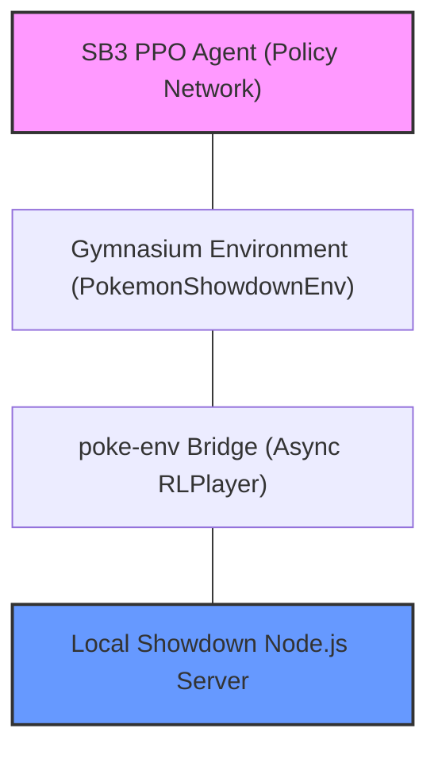

# Pokémon Battle RL: Autonomous Competitive Agent

An advanced reinforcement learning framework for training and evaluating autonomous agents in competitive Pokémon battles. This project bridges the high-fidelity **Pokémon Showdown** simulator with modern RL pipelines (**Stable-Baselines3**, **Gymnasium**) to explore strategic decision-making in complex, stochastic environments.

---

## 1. Project Overview

### What is the Pokémon RL Battle Agent?
This project is an end-to-end pipeline designed to train a Deep Reinforcement Learning agent to play competitive Pokémon battles at a high level. Unlike many "toy" game environments, Pokémon represents an extreme challenge for RL due to its massive state space, hidden information, and complex dependencies.

### Why Pokémon Battles are Challenging for RL
*   **Massive State Space**: With 800+ Pokémon, hundreds of moves, and dynamic variables (HP, status, stat boosts, weather, terrain), the number of possible game states exceeds that of Chess or Go.
*   **Partial Observability**: Agents must make decisions without knowing the opponent's held items, full move sets, or exact stat distributions until they are revealed during play.
*   **Non-Stationary Dynamics**: The "meta-game" shifts constantly; a strategy that works against defensive teams might fail against aggressive ones.
*   **Long Horizon Credit Assignment**: A decision made on Turn 1 (e.g., setting up Stealth Rock) may only yield a "reward" (a faint) on Turn 40.
*   **Switching Mechanics**: The ability to "pivot" or switch Pokémon mid-battle introduces a unique layer of strategic complexity uncommon in typical grid-based or board-game RL.

---

## 2. System Architecture

The project implements a multi-layered architecture to ensure absolute fidelity to game mechanics while maintaining high-performance training throughput.

### Data Flow & Component Stack

*   **Showdown Server**: The industry-standard Node.js simulator handling the actual battle engine.
*   **poke-env Bridge**: Handles the WebSocket protocol and translates Showdown's text-based messages into structured Python objects.
*   **Gymnasium Environment**: A custom wrapper that provides a standard `step()` and `reset()` interface. It features a **Synchronous Request-Response Queue** pattern to prevent desynchronization during asynchronous battle events.
*   **PPO Pipeline**: Utilizes Stable-Baselines3's Proximal Policy Optimization to iteratively improve the agent's battle policy.

---

## 3. Current Capabilities

The system has reached a stable "Production-Ready" state for research and development:

*   **Deterministic Synchronization**: Resolved the "Turn 2 Freeze" bug using an `asyncio.Queue` rendezvous pattern, ensuring `step()` only returns after the server has fully processed the previous action.
*   **Session Isolation**: UUID-based unique naming for agents and opponents allows for multiple concurrent training sessions without interference.
*   **Stable Training**: Verified stability over long-duration runs (300+ episodes) with consistent memory and CPU usage.
*   **Human-vs-Agent Pipeline**: A dedicated inference mode (`battle_vs_human.py`) allows developers to test the agent's skills in real-time.
*   **Dense Reward Shaping**: Implemented a damage-differential and faint-tracking reward system to provide granular feedback to the agent.

---

## 4. Training & Learning Pipeline

### Observation Vector (23 Dimensional)
The agent perceives the battlefield through a normalized vector including:
*   Strategic metrics (Turn count, remaining team members).
*   Health status (HP fractions for all active and benched Pokémon).
*   Tactical data (Type effectiveness multipliers, weather/terrain flags).
*   Resource tracking (Action availability masks).

### Reward Structure
*   **Intermediate**: `(Damage Dealt - Damage Taken)` delta + `0.5` per enemy faint.
*   **Terminal**: `+2.0` for a Win, `-2.0` for a Loss.
*   **Deterrence**: `-0.02` per turn penalty to encourage aggressive, efficient play.

### Workflow
1.  **Training**: `python train_ppo.py` runs a specified number of steps against a baseline `RandomPlayer`.
2.  **Inference**: `python battle_vs_human.py` loads the saved `.zip` model and waits for a challenge.

---

## 5. Known Strategic Limitations
While the framework is robust, the agent currently exhibits several "lower-level" behaviors:
*   **Myopic Switching**: Prefers raw damage over strategic pivots to defensive "walls."
*   **Lack of Foresight**: Does not currently plan for late-game "cleanup" with specific sweepers.
*   **Setup Blindness**: Does not fully grasp the value of "boosting" moves (e.g., Swords Dance) vs. immediate damage.
*   **Observation Gaps**: Entry hazards (Stealth Rock) and Stat Stages are currently excluded from the observation space.

---

## 6. Future Development Roadmap

### Phase 1: Observation & Data Expansion
*   [ ] Integrate **Stat Boost Stages** and **Entry Hazards** into the observation vector.
*   [ ] Track move PP and weather/terrain duration.

### Phase 2: Algorithmic Diversity
*   [ ] **Dueling DQN**: Implement and compare a DQN-based agent against the current PPO performance.
*   [ ] **Curriculum Learning**: Train against increasingly difficult heuristic-based opponents.

### Phase 3: Strategic Mastery
*   [ ] **Self-Play**: Enable the agent to battle against previous versions of itself.
*   [ ] **Planning Modules**: Explore Monte Carlo Tree Search (MCTS) for move-prediction integration.

---

## 7. Project Structure
*   `python/pokemon_env.py`: The core Gymnasium engine and synchronization logic.
*   `python/train_ppo.py`: Configuration and execution of the SB3 training loop.
*   `python/battle_vs_human.py`: Interactive inference script for human challenge mode.
*   `python/ash_team.txt` / `leon_team.txt`: Standardized Pokémon team configurations.
*   `showdown/`: Local instance of the Pokémon Showdown server.

---

## 8. Final Vision
Our ultimate goal is to develop a research-grade Pokémon AI capable of climbing the **public Smogon ladders**. We aim to build an agent that not only masters the math of damage calculation but demonstrates emergent "human-like" strategic qualities: predicting switches, sacrificing low-value members to gain momentum, and executing late-game sweeps with precision.
